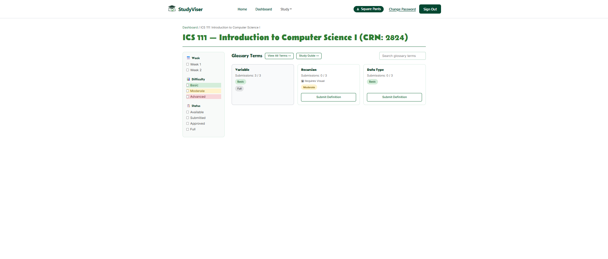
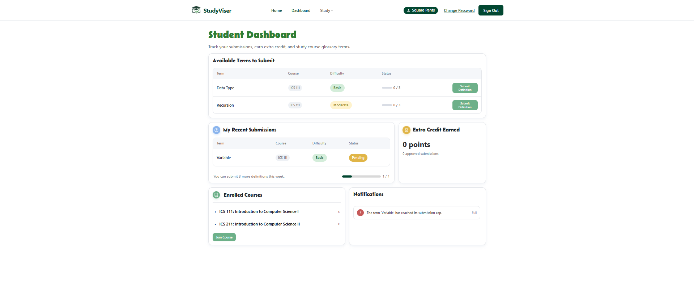
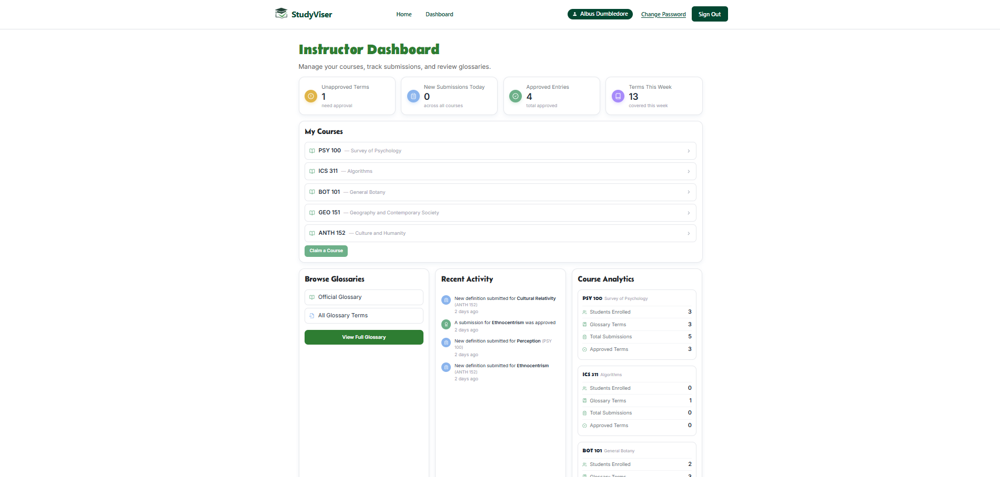

The Study-Viser app is a study management platform for students, instructors, and TAs. Instructors define terminology needs. Students submit definitions, TAs approve the best ones. A living, course-specific glossary is born.

### Overview

StudyViser is a collaborative academic platform designed to bridge the gap between lecture content and student comprehension. Unlike static study guides, StudyViser facilitates a dynamic ecosystem where instructors define learning goals, students earn extra credit for contributing high-quality materials, and TAs provide quality assurance. By transforming study resources into a living, institution-verified "academic commons," the platform ensures students no longer have to navigate complex courses alone.

### Contributions

- Configured the NeonDB database and deployed the application to Vercel
- Created the UI for the landing page, contacts page, and courses page
- Created end to end tests for the application using Playwright
- Other contributions and source code viewable at [https://github.com/orgs/study-viser](url)

### Impact

StudyViser transforms the traditional, isolated study experience into a collaborative ecosystem that benefits every level of the academic hierarchy:

For Students: Democratizing Academic Success
StudyViser levels the playing field by providing a centralized, "living" repository of verified materials. By allowing students to preview course demands and access instructor-approved glossaries, the platform reduces academic anxiety and ensures that study efforts are aligned with course objectives. The extra-credit incentive turns passive consumers into active contributors, fostering a deeper mastery of the subject matter.

For Instructors: Streamlined Resource Management
Instead of manually updating study guides every semester, instructors can leverage the collective intelligence of their top students. StudyViser automates the collection of quality materials, allowing instructors to define the curriculum structure while delegating the "heavy lifting" of content creation to a verified pipeline of students and TAs.

For Institutions: Building a Lasting Academic Commons
The platform prevents the "knowledge leak" that occurs when a semester ends. By archiving and exporting resources as Open Educational Resources (OER), StudyViser helps universities build a permanent intellectual asset. This ensures that the collective effort of one cohort provides a foundation for the next, continuously improving the quality of education at the University of Hawaiʻi at Mānoa.

Quality Assurance & Integrity
Unlike third-party "study aid" sites that often host unverified or unauthorized content, StudyViser operates within the institutional framework. The TA-led approval workflow ensures that every entry meets the bar for accuracy, maintaining high academic standards while preventing the spread of misinformation.

### Screenshots

